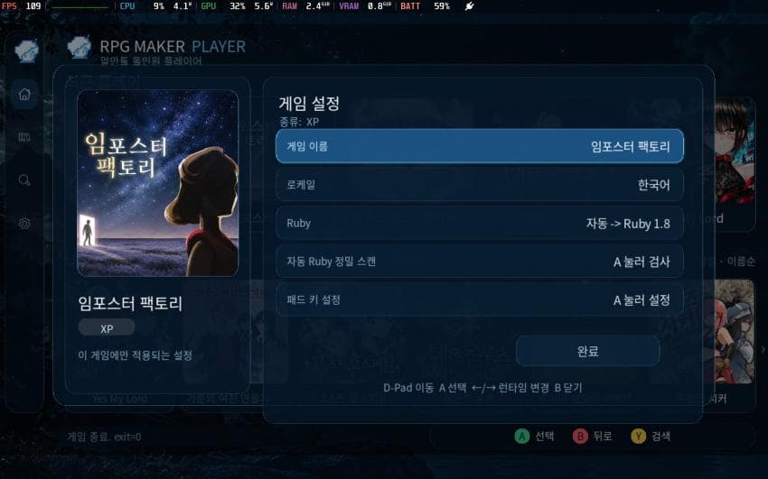
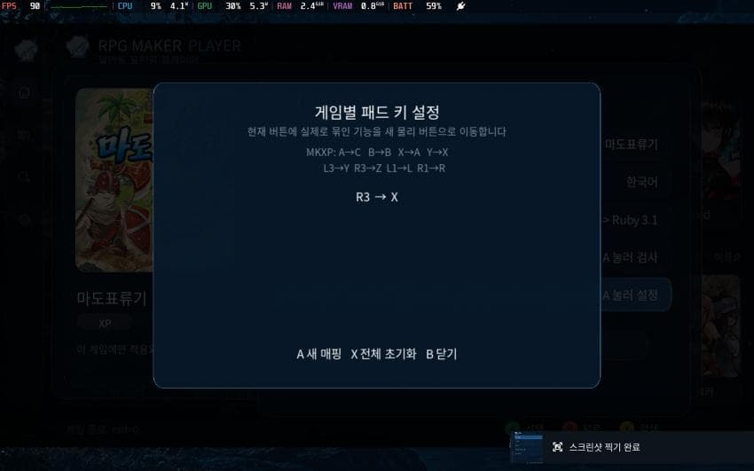
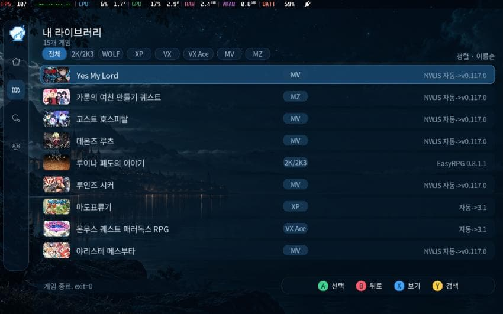

# RPG Maker Player

[한국어](README_KO.md) | **English**


**RPG Maker Player** is a SteamOS-focused all-in-one launcher for RPG Maker and WOLF RPG Editor games. It scans one game library folder, detects the engine/runtime, and launches games through the appropriate compatibility layer.

## What's new in v1.3

- Added an **Update** item under Settings. It shows the current version and only checks GitHub when you explicitly press **Check for updates**. There is no automatic update check at startup.
- When a newer release exists, the launcher shows the new version and asks whether to download and install it. OTA packages are SHA-256 verified before extraction.
- In-game **Select + X** manually opens the SteamOS on-screen keyboard. It is open-only; closing the keyboard uses SteamOS's normal keyboard controls.
- **RPG Maker XP / VX / VX Ace can use Proton compatibility mode** from per-game settings as a fallback when native mkxp-z compatibility is not enough. MV/MZ can use the same Proton compatibility path.
- Expanded native RGSS compatibility across Ruby 1.8 / 1.9 / 3.1 with Win32API/DLL normalization and conditional compatibility patches/ports derived from rpgmakermlinux-cicpoffs/Kawariki work.
- Fixed Ruby 1.9 launch failures when RPG Maker Player is installed in a path containing spaces.
- Hold **Start + Select for 1.5 seconds** while a game is running to terminate the current game directly with no popup.
- The full and update packages preserve launcher settings, catalogs, game list, cache/log data and user game content.

## Screenshots

| Home | Game settings |
|---|---|
|  |  |
| Per-game controller mapping | Library list view |
|  |  |

## Supported engines

| Engine | Runtime / method | Notes |
|---|---|---|
| RPG Maker 2000 / 2003 | EasyRPG Player | Folder games plus `.zip` / `.easyrpg` packages; per-game encoding support |
| RPG Maker XP | mkxp-z / optional Proton | Ruby 1.8 / 1.9 / 3.1 auto detection, manual override, deep compatibility scan, Proton fallback |
| RPG Maker VX | mkxp-z / optional Proton | Ruby 1.8 / 1.9 / 3.1 auto detection, manual override, deep compatibility scan, Proton fallback |
| RPG Maker VX Ace | mkxp-z / optional Proton | Ruby 1.8 / 1.9 / 3.1 auto detection, manual override, deep compatibility scan, Proton fallback |
| RPG Maker MV | NW.js | Automatic runtime selection, compatibility scan, case-insensitive path helpers |
| RPG Maker MZ | NW.js | Automatic runtime selection, compatibility scan, case-insensitive path helpers |
| WOLF RPG Editor | Proton | Steam Proton launch path with windowed compatibility handling |

Compatibility is best-effort. RPG Maker games can use custom plugins, scripts, native libraries, encryption, or unusual runtime assumptions, so some titles may still require game-specific fixes.

## Supported UI languages

- English
- 한국어 (Korean)
- 日本語 (Japanese)

The launcher detects Steam / desktop / system locale information. Per-game locale profiles are also available for Korean, Japanese, and English environments.

## Installation on SteamOS

1. Download **`RPG_Maker_Player_SteamOS_V1.3.tar.gz`** from the v1.3 Release.
2. Extract it. Extraction on Windows is supported.
3. Copy the extracted **`rpg maker player`** folder to your SteamOS device.
4. Enter **Desktop Mode**.
5. Run **`RPG Maker Player.desktop`** inside the folder.
   - SteamOS may ask you to allow/trust the `.desktop` file the first time. This initial permission prompt cannot be granted by the file before it runs.
   - The installer does **not** launch RPG Maker Player.
6. The installer automatically:
   - restores executable permissions for bundled launchers/runtimes,
   - creates a Desktop shortcut using `ICON.PNG`,
   - registers **RPG Maker Player** as a non-Steam game,
   - applies the included Steam artwork.
7. When you see:

   `Registered in Gaming Mode.`  
   `Please launch it from Gaming Mode.`

   switch back to Gaming Mode and start **RPG Maker Player** from your Library.

If you move the whole `rpg maker player` folder later, run the registration `.desktop` file again to refresh the stored path and Steam artwork.

## First launch / game library

On the first launcher start, select the folder that contains your games. Each normal game can live in its own subfolder. The launcher scans the selected root and classifies supported engines automatically.

Example:

```text
Games/
├─ Game A/
├─ Game B/
├─ Game C/
└─ _image/
   ├─ Game A.png
   ├─ Game B.png
   └─ Game C.png
```

Custom thumbnails use:

```text
<game root>/_image/<actual game folder name>.png
```

The launcher watches thumbnail changes and reloads replaced PNG files while it is running.

## Controller controls

| Input | Action |
|---|---|
| D-pad / Left Stick | Navigate |
| A | Select / launch / confirm |
| B | Home: open sidebar menu / Elsewhere: back or close |
| X | Toggle grid/list view in Library |
| Y | Open search |
| LB / RB | Previous / next page |
| LT / RT | Quick-cycle engine filter |
| Select (tap) | Open selected game's settings |
| Start (tap) | No standalone action in the Library |
| Start + Select (hold ~0.3 sec, launcher screen) | Open launcher exit confirmation |
| Start + Select (hold 1.5 sec, while a game is running) | Exit the current game directly; no popup |
| Select + X (while a game is running) | Open the SteamOS on-screen keyboard |

### Folder picker

| Input | Action |
|---|---|
| A | Enter selected folder |
| B | Go to parent folder |
| X | Use current folder |
| Y | Cancel |

### Game settings

| Input | Action |
|---|---|
| Up / Down | Move between settings |
| Left / Right | Change value |
| A | Apply / open selected setting |
| B | Close settings |

For XP / VX / VX Ace / MV / MZ, per-game settings can enable **Proton compatibility mode** and select a Proton runtime/environment preset when native execution is not compatible enough.

### Per-game controller remapping

| Input | Action |
|---|---|
| A | Start a new mapping |
| X | Reset all mappings for the game |
| B | Close mapping screen |
| Start | Cancel current capture |

## Keyboard controls

| Key | Action |
|---|---|
| Arrow keys | Navigate |
| Enter / Z | Confirm |
| Tab | Open selected game's settings |
| Esc | Back / exit prompt |
| X / V | Toggle Library grid/list view |
| F2 | Change game root folder |
| F3 | Filter / sort |
| F4 | Search |
| Page Up / Page Down | Previous / next Library page |

## Engine-specific notes

### RPG Maker 2000 / 2003
EasyRPG Player is used. Korean CP949, Japanese CP932 and Western CP1252-style encoding profiles are supported. Standalone `.zip` and `.easyrpg` packages can be detected as EasyRPG titles.

### RPG Maker XP / VX / VX Ace
mkxp-z is used by default. The launcher can auto-detect Ruby compatibility across 1.8, 1.9 and 3.1, cache the result, manually override it, or run a deeper script compatibility scan from per-game settings. The native path includes expanded Win32API/DLL compatibility and conditional RGSS plugin patches. If a Windows-only script or DLL still prevents native execution, enable **Proton compatibility mode** for that game from per-game settings.

### RPG Maker MV / MZ
NW.js runtimes are selected automatically. The launcher also includes case-insensitive filesystem/path compatibility helpers for Windows-authored game data.

### WOLF RPG Editor
WOLF games run through Steam Proton. Proton Experimental can be requested through Steam if needed. The launcher uses a windowed compatibility path because SteamOS/Gamescope handles fullscreen presentation itself.

## Manual updates / OTA

Open **Settings → Update** to see the installed version. The launcher does **not** contact GitHub automatically at startup.

1. Select **Check for updates**.
2. If a newer release exists, its version is displayed.
3. Confirm **Download and install**.
4. The launcher downloads the matching OTA package, verifies its SHA-256 file, and installs only application files.
5. Restart RPG Maker Player after installation.

For older installations that do not yet contain the in-app updater, the v1.3 Release also provides **`RPG_Maker_Player_SteamOS_Update_V1.3.tar.gz`**, a cumulative update package intended to be overlaid on a v1.0-or-newer installation without replacing user game/config data.

## Steam artwork

The release installer automatically registers the included artwork:

- 600×900 portrait grid
- 920×430 landscape grid
- 1920×640 hero background
- transparent logo
- 512×512 desktop/Steam icon

## Source layout

```text
src/                    RPG Maker Player launcher source
scripts/                SteamOS run/register/package scripts
runtime/                Runtime helper scripts and MV/MZ compatibility patches
preload/                RGSS compatibility preload scripts
assets/                 UI, Steam artwork, SoundFont and notices
third_party/mkxp-z/      Modified mkxp-z source used by the release
third_party/cicpoffs/    cicpoffs source
third_party/rpgmakermlinux-cicpoffs/
                        rpgmakermlinux compatibility patches/source material
```

## Thanks / upstream projects

RPG Maker Player exists thanks to the work of these open-source projects and communities:

- [mkxp-z](https://github.com/mkxp-z/mkxp-z) — RGSS runtime used for XP / VX / VX Ace.
- [EasyRPG Player](https://github.com/EasyRPG/Player) — RPG Maker 2000 / 2003 runtime.
- [NW.js](https://github.com/nwjs/nw.js) — runtime used for RPG Maker MV / MZ.
- [Ruby](https://github.com/ruby/ruby) — Ruby runtimes used by RGSS compatibility layers.
- [rpgmakermlinux-cicpoffs](https://github.com/bakustarver/rpgmakermlinux-cicpoffs) — Linux RPG Maker MV/MZ compatibility work used as a reference/base for the MV/MZ path.
- [cicpoffs](https://github.com/adlerosn/cicpoffs) — case-insensitive filesystem compatibility layer.
- [SDL](https://github.com/libsdl-org/SDL), [SDL_image](https://github.com/libsdl-org/SDL_image), [SDL_ttf](https://github.com/libsdl-org/SDL_ttf) — launcher UI/input/rendering stack.
- [Valve Proton](https://github.com/ValveSoftware/Proton) — WOLF RPG Editor compatibility path.
- TimGM6mb SoundFont — MIDI playback fallback; copyright/license details are preserved in `assets/soundfonts/TimGM6mb.LICENSE.txt`.

See [THIRD_PARTY_NOTICES.md](THIRD_PARTY_NOTICES.md) and the license files inside each third-party directory for details.

## License

The original RPG Maker Player launcher/source in this repository is released under **GPL-3.0-or-later**. Third-party components retain their own upstream licenses; those license texts and notices are preserved in this repository and in the binary release where applicable.

RPG Maker, WOLF RPG Editor, Steam, SteamOS and other product names are trademarks of their respective owners. This project is not affiliated with or endorsed by their owners.