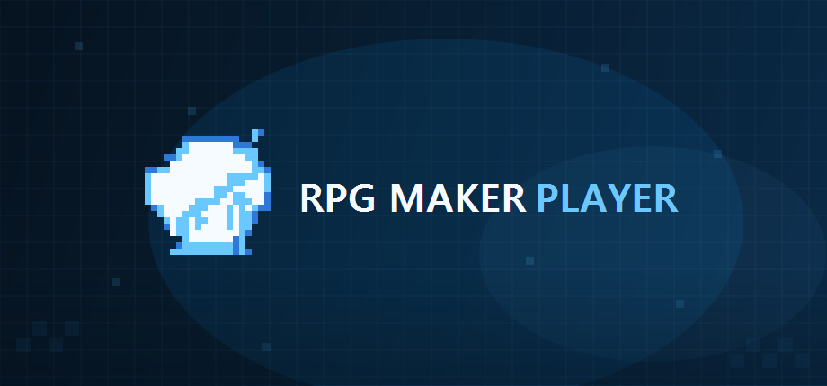
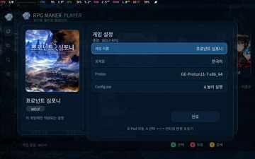

# RPG Maker Player

**한국어** | [English](README.md)



**RPG Maker Player**는 SteamOS용 RPG Maker / WOLF RPG Editor 올인원 런처입니다. 하나의 게임 루트를 스캔해 엔진과 필요한 런타임을 판별하고 각 게임에 맞는 실행 방식을 자동으로 선택합니다.

## 스크린샷

| 게임 설정 | WOLF 설정 |
|---|---|
|  |  |

## 지원 엔진

| 엔진 | 실행 방식 | 주요 기능 |
|---|---|---|
| RPG Maker 2000 / 2003 | EasyRPG Player | 폴더 게임 및 `.zip` / `.easyrpg`, 게임별 인코딩 지원 |
| RPG Maker XP | mkxp-z | Ruby 1.8 / 1.9 / 3.1 자동 판별, 수동 지정, 정밀 스캔 |
| RPG Maker VX | mkxp-z | Ruby 1.8 / 1.9 / 3.1 자동 판별, 수동 지정, 정밀 스캔 |
| RPG Maker VX Ace | mkxp-z | Ruby 1.8 / 1.9 / 3.1 자동 판별, 수동 지정, 정밀 스캔 |
| RPG Maker MV | NW.js | 런타임 자동 선택, 호환성 검사, 대소문자 경로 보정 |
| RPG Maker MZ | NW.js | 런타임 자동 선택, 호환성 검사, 대소문자 경로 보정 |
| WOLF RPG Editor | Proton | Steam Proton 기반 실행, 창모드 호환 처리 |

RPG Maker 계열은 게임마다 플러그인, 커스텀 스크립트, 네이티브 DLL, 암호화 방식 등이 매우 다양하므로 모든 게임의 100% 호환을 보장하지는 않습니다. 필요한 경우 게임별 설정/호환 패치가 필요할 수 있습니다.

## 지원 언어

런처 UI:

- 한국어
- English
- 日本語

Steam/데스크톱/시스템 로케일 정보를 이용해 언어를 감지합니다. 게임별 실행 로케일은 한국어/일본어/영어 프로필을 지원합니다.

## SteamOS 설치 방법

1. v1.0 Release에서 **`RPG_Maker_Player_SteamOS_WINDOWS_SAFE.tar.gz`**를 다운로드합니다.
2. 압축을 풉니다. Windows에서 압축을 풀어도 됩니다. v1.0 Windows-safe 패키지는 Linux 심볼릭 링크를 제거한 배포본입니다.
3. 압축 해제된 **`rpg maker player`** 폴더를 SteamOS 기기로 복사합니다.
4. SteamOS **Desktop Mode**로 들어갑니다.
5. 폴더 안의 **`RPG Maker Player.desktop`**을 실행합니다.
   - 최초 1회 SteamOS에서 `.desktop` 실행 허용/신뢰 확인이 뜰 수 있습니다. 파일이 실행되기 전에는 자기 자신의 권한을 설정할 수 없으므로 이 최초 확인만은 수동으로 허용해야 합니다.
   - 이 설치용 `.desktop`은 RPG Maker Player 런처 자체를 실행하지 않습니다.
6. 설치 스크립트가 자동으로:
   - 번들된 런처/런타임 실행 권한을 복구하고,
   - `ICON.PNG` 기반 바탕화면 바로가기를 만들고,
   - Steam 비-Steam 게임으로 `RPG Maker Player`를 등록하고,
   - 포함된 Steam 아트워크를 자동 적용합니다.
7. 아래 메시지가 나오면 완료입니다.

   `게이밍모드에 등록되었습니다.`  
   `게이밍모드에서 실행해주세요`

이후 Gaming Mode로 돌아가 라이브러리에서 **RPG Maker Player**를 실행하면 됩니다.

나중에 `rpg maker player` 폴더 위치를 옮겼다면 설치용 `.desktop`을 다시 한 번 실행하면 저장된 실행 경로와 Steam 아트워크가 갱신됩니다.

## 첫 실행 / 게임 폴더

런처 첫 실행 시 게임들이 들어 있는 루트 폴더를 선택합니다. 일반적인 게임은 루트 아래 각각의 하위 폴더에 넣으면 됩니다.

예시:

```text
Games/
├─ 게임 A/
├─ 게임 B/
├─ 게임 C/
└─ _image/
   ├─ 게임 A.png
   ├─ 게임 B.png
   └─ 게임 C.png
```

커스텀 썸네일 경로:

```text
<게임 루트>/_image/<실제 게임 폴더명>.png
```

같은 이름의 PNG를 수정/덮어쓰면 런처 실행 중에도 변경을 감지해 다시 불러옵니다.

## 게임패드 버튼 설명

| 버튼 | 기능 |
|---|---|
| 방향키 / 왼쪽 아날로그 | 이동 |
| A | 선택 / 실행 / 확인 |
| B | 뒤로 / 닫기 / 홈 방향으로 복귀 |
| X | 라이브러리 그리드/리스트 전환 |
| Y | 검색 |
| LB / RB | 이전 / 다음 페이지 |
| LT / RT | 엔진 필터 빠른 전환 |
| Select 짧게 | 선택한 게임 설정 열기 |
| Start 짧게 | 필터 / 정렬 열기 |
| Start + Select 약 0.3초 | 종료 확인창 |

### 폴더 선택 화면

| 버튼 | 기능 |
|---|---|
| A | 선택한 폴더로 들어가기 |
| B | 상위 폴더 |
| X | 현재 폴더 사용 |
| Y | 취소 |

### 게임 설정

| 버튼 | 기능 |
|---|---|
| 위 / 아래 | 설정 항목 이동 |
| 왼쪽 / 오른쪽 | 값 변경 |
| A | 적용 / 선택 항목 실행 |
| B | 설정 닫기 |

### 게임별 패드 키 설정

| 버튼 | 기능 |
|---|---|
| A | 새 매핑 시작 |
| X | 해당 게임의 저장된 매핑 전체 초기화 |
| B | 닫기 |
| Start | 현재 키 입력 캡처 취소 |

## 키보드 단축키

| 키 | 기능 |
|---|---|
| 방향키 | 이동 |
| Enter / Z | 확인 |
| Tab | 선택한 게임 설정 |
| Esc | 뒤로 / 종료 확인 |
| X / V | 라이브러리 그리드/리스트 전환 |
| F2 | 게임 루트 변경 |
| F3 | 필터 / 정렬 |
| F4 | 검색 |
| Page Up / Page Down | 라이브러리 이전 / 다음 페이지 |

## 엔진별 참고사항

### RPG Maker 2000 / 2003
EasyRPG Player를 사용합니다. 한국어 CP949, 일본어 CP932, 서구권 CP1252 계열 인코딩 프로필을 지원합니다. `.zip` 또는 `.easyrpg` 단독 패키지도 EasyRPG 게임으로 감지할 수 있습니다.

### RPG Maker XP / VX / VX Ace
mkxp-z를 사용합니다. Ruby 1.8 / 1.9 / 3.1 호환성을 자동 판별하고 결과를 캐시합니다. 게임 설정에서 수동 런타임 선택 또는 더 엄밀한 Ruby 정밀 스캔도 사용할 수 있습니다.

### RPG Maker MV / MZ
NW.js 런타임을 자동 선택합니다. Windows에서 제작된 게임의 Linux 대소문자 경로 문제를 완화하기 위한 case-insensitive 보조 기능도 포함됩니다.

### WOLF RPG Editor
Steam Proton을 통해 실행합니다. 필요한 경우 Proton Experimental 설치를 Steam에 요청할 수 있습니다. SteamOS/Gamescope가 전체화면 표시를 담당하므로 게임 자체는 호환성을 위해 창모드 실행 경로를 사용합니다.

## Steam 아트워크

설치 과정에서 아래 아트워크를 자동 등록합니다.

- 600×900 세로 썸네일
- 920×430 가로 썸네일
- 1920×640 상단 Hero 배경
- 투명 로고
- 512×512 바탕화면/Steam 아이콘

## 소스 구조

```text
src/                    RPG Maker Player 런처 소스
scripts/                SteamOS 실행/등록/패키징 스크립트
runtime/                런타임 보조 스크립트 및 MV/MZ 호환 패치
preload/                RGSS 호환 preload 스크립트
assets/                 UI, Steam 아트워크, SoundFont 및 고지문
third_party/mkxp-z/      실제 배포본에 사용한 수정 mkxp-z 소스
third_party/cicpoffs/    cicpoffs 소스
third_party/rpgmakermlinux-cicpoffs/
                        MV/MZ 호환에 참고/사용한 패치와 소스
```

## Thanks / 사용된 오픈소스

아래 프로젝트들의 작업이 없었다면 RPG Maker Player를 만들 수 없었습니다. 감사합니다.

- [mkxp-z](https://github.com/mkxp-z/mkxp-z) — XP / VX / VX Ace용 RGSS 런타임
- [EasyRPG Player](https://github.com/EasyRPG/Player) — RPG Maker 2000 / 2003 런타임
- [NW.js](https://github.com/nwjs/nw.js) — RPG Maker MV / MZ 런타임
- [Ruby](https://github.com/ruby/ruby) — RGSS 호환 계층의 Ruby 런타임
- [rpgmakermlinux-cicpoffs](https://github.com/bakustarver/rpgmakermlinux-cicpoffs) — MV/MZ Linux 호환 경로에 참고/사용
- [cicpoffs](https://github.com/adlerosn/cicpoffs) — 대소문자 비구분 파일시스템 호환 계층
- [SDL](https://github.com/libsdl-org/SDL), [SDL_image](https://github.com/libsdl-org/SDL_image), [SDL_ttf](https://github.com/libsdl-org/SDL_ttf) — 런처 UI/입력/렌더링
- [Valve Proton](https://github.com/ValveSoftware/Proton) — WOLF RPG Editor 실행 호환 계층
- TimGM6mb SoundFont — MIDI 재생 fallback. 저작권/라이선스 원문은 `assets/soundfonts/TimGM6mb.LICENSE.txt`에 보존했습니다.

자세한 내용은 [THIRD_PARTY_NOTICES.md](THIRD_PARTY_NOTICES.md) 및 각 third-party 폴더의 라이선스 원문을 확인하세요.

## 라이선스

이 저장소에서 RPG Maker Player가 직접 작성한 런처/소스 부분은 **GPL-3.0-or-later**로 공개합니다. 서드파티 구성요소는 각각의 upstream 라이선스를 그대로 따르며 원문 라이선스/고지문을 저장소와 배포본에 보존합니다.

RPG Maker, WOLF RPG Editor, Steam, SteamOS 및 기타 제품명/상표는 각 권리자에게 귀속됩니다. 이 프로젝트는 해당 회사/권리자의 공식 프로젝트가 아닙니다.